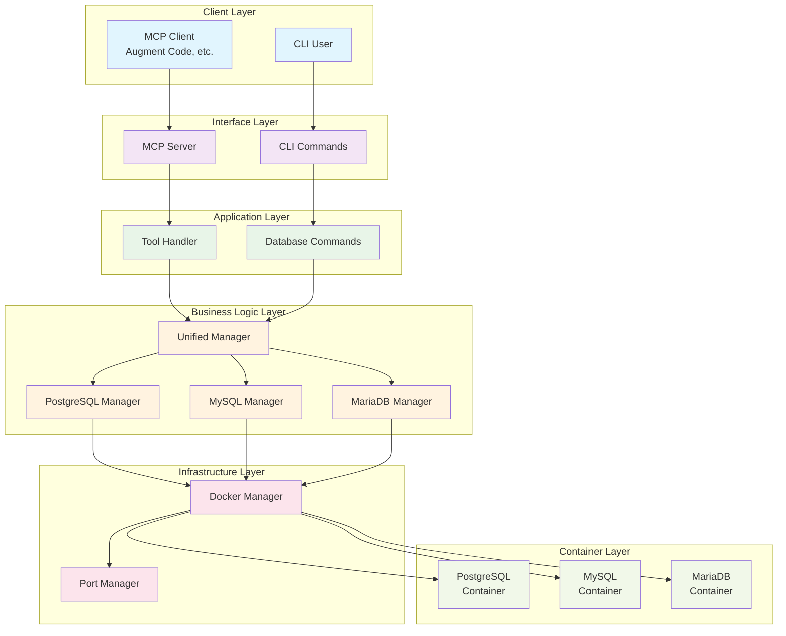

# Architecture

This document describes the clean, modern architecture of the dev-postgres-mcp multi-database management system.

## Overview

The dev-postgres-mcp system is designed as a Model Context Protocol (MCP) server that provides unified management of ephemeral database instances across multiple database types (PostgreSQL, MySQL, MariaDB). The architecture follows a layered approach with clear separation of concerns.

## Architecture Diagram

## Layer Descriptions

### Client Layer
- **MCP Client**: External clients like Augment Code that communicate via the Model Context Protocol
- **CLI User**: Direct command-line interface users

### Interface Layer
- **MCP Server**: Handles MCP protocol communication and tool registration
- **CLI Commands**: Command-line interface for direct database management

### Application Layer
- **Tool Handler**: Processes MCP tool calls and routes them to appropriate managers
- **Database Commands**: Handles CLI command execution and user interaction

### Business Logic Layer
- **Unified Manager**: Central orchestrator that provides a unified interface for all database operations
- **Database-Specific Managers**: Individual managers for PostgreSQL, MySQL, and MariaDB that handle database-specific logic

### Infrastructure Layer
- **Docker Manager**: Manages Docker container lifecycle, networking, and resource allocation
- **Port Manager**: Handles dynamic port allocation and conflict resolution

### Container Layer
- **Database Containers**: Actual Docker containers running the database instances

## Key Design Principles

### 1. Unified Interface
All database operations are exposed through a single, consistent interface regardless of the underlying database type. This simplifies client interaction and reduces complexity.

### 2. Database-Agnostic Operations
Common operations (create, list, get, drop, health check) work identically across all supported database types, with database-specific details handled internally.

### 3. Clean Separation of Concerns
Each layer has a specific responsibility:
- Interface layers handle protocol/user interaction
- Application layers handle request processing
- Business logic layers handle database management
- Infrastructure layers handle resource management

### 4. Extensibility
New database types can be added by implementing the `DatabaseManager` interface and registering with the unified manager.

### 5. Resource Management
Centralized port allocation and Docker container management ensure efficient resource utilization and prevent conflicts.

## Data Flow

### Creating a Database Instance
1. Client sends `create_database_instance` request via MCP or CLI
2. Tool Handler/DB Commands validate parameters
3. Unified Manager routes to appropriate database-specific manager
4. Database Manager requests resources from Docker Manager
5. Docker Manager allocates port and creates container
6. Database Manager configures and starts the database
7. Instance details are returned to the client

### Listing Database Instances
1. Client requests instance list (optionally filtered by type)
2. Unified Manager queries all or specific database managers
3. Database Managers query Docker Manager for container status
4. Consolidated list is returned to the client

### Managing Instance Lifecycle
1. All lifecycle operations (get, drop, health check) follow similar patterns
2. Unified Manager routes to appropriate database manager
3. Database Manager coordinates with Docker Manager
4. Results are returned through the same path

## Benefits of This Architecture

1. **Simplicity**: Clean, modern design without legacy compatibility layers
2. **Maintainability**: Clear separation of concerns makes the codebase easy to understand and modify
3. **Extensibility**: New database types can be added without affecting existing code
4. **Consistency**: Unified interface provides consistent behavior across all database types
5. **Resource Efficiency**: Centralized resource management prevents conflicts and optimizes utilization
6. **Testability**: Each layer can be tested independently with clear interfaces
